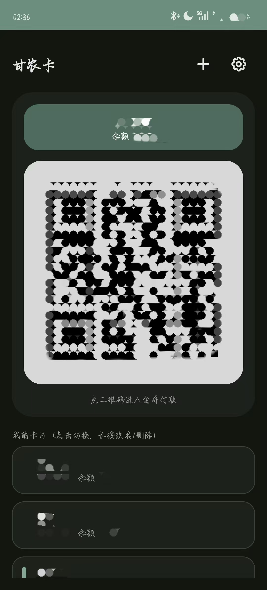
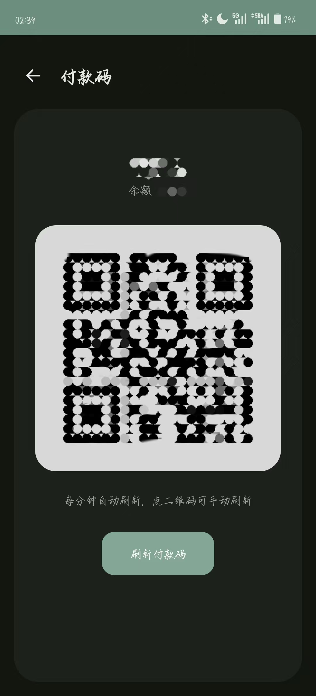
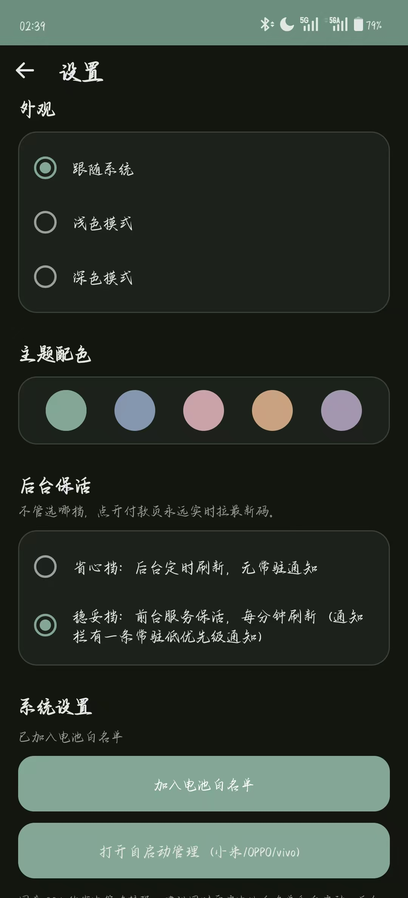

<div align="center">


# 甘农卡

**把甘肃农业大学校园卡付款码放到手机桌面，打开即用。**

付款时瞄一眼桌面组件或点开全屏，省去从微信或者企业微信层层跳转。

>[!important]
>本软件目前仅支持 Android 系统，包括 OPPO、OnePlus 的 ColorOS、OxygenOS，小米的 HyperOS，以及 vivo 的 OriginOS 等。iOS 暂不支持。华为可安装 APK 的 HarmonyOS 版本理论上可以使用，但不保证稳定性；HarmonyOS NEXT 已实现基础功能，不过组件卡片暂时无法自动刷新。


<br />

[](https://developer.android.com)
[](https://apilevels.com)
[](https://kotlinlang.org)
[](LICENSE)
[](https://github.com/RE-TikaRa/GSAU-Card/releases)

</div>

---

二维码在本地渲染（ZXing），后台只取页面里那段 32 位付款码内容，传输量极小，清晰度和尺寸随意控制。

<br />

<table>
<tr>
<td width="55%" valign="top">

### 组件卡

外层圆角卡，顶部一条姓名条，下方一整块大圆角二维码。

- 点 **姓名条** → 切换用户
- 点 **二维码** → 打开全屏付款页
- 点 **刷新** → 就地拉最新码

</td>
<td width="45%" valign="top" align="center">


</td>
</tr>
</table>

<table>
<tr>
<td width="55%" valign="top">

### 主界面

当前卡的姓名条加大二维码摆在最上头，下方一列账号任你切换。

- 点 **账号** → 切成当前卡
- 长按 **账号** → 弹菜单，改备注名或删除
- 点右上 **＋** → 粘贴链接添加新卡
- 点右上 **齿轮** → 进设置页

</td>
<td width="45%" valign="top" align="center">



</td>
</tr>
</table>

<table>
<tr>
<td width="55%" valign="top">

### 全屏付款页

打开即实时拉最新码，屏幕自动提亮到最大，付款那一刻码是新的。

- 打开 **全屏付款页** → 进页面就拉一次最新码
- 每 **30 秒** → 自动再刷，不依赖后台
- 点 **刷新付款码** → 立刻就地重拉

</td>
<td width="45%" valign="top" align="center">



</td>
</tr>
</table>

<table>
<tr>
<td width="55%" valign="top">

### 设置页

主题、配色、后台保活都在这，国产 ROM 的白名单也一键直达。

- 选 **主题** → 浅色 / 深色 / 跟随系统
- 选 **配色** → 五套莫兰迪，App 与组件同步换色
- 选 **保活档** → 省心档或稳妥档
- 点 **白名单 / 自启动** → 跳系统设置放行后台

</td>
<td width="45%" valign="top" align="center">



</td>
</tr>
</table>

## 功能

| 功能 | 说明 |
|---|---|
| **桌面组件** | 外层圆角卡 + 姓名条 + 大圆角二维码，点姓名条切换用户，点二维码进全屏 |
| **全屏付款页** | 打开即实时拉最新码，自动提亮屏幕，每 30 秒刷新，不依赖后台 |
| **多账号** | 粘贴链接添加多张卡，App 与组件都能切换；列表长按弹菜单，可起本机备注名或删除 |
| **深色模式** | 浅色 / 深色 / 跟随系统三档，设置页手动切换，冷启动即生效 |
| **主题配色** | 五套莫兰迪配色（灰绿·灰蓝·藕粉·陶土·灰紫），App 各页与桌面组件同步换色 |
| **统一视觉** | Tabler 描边图标，应用内自定义弹窗，Material Snackbar 轻提示，二级页统一顶栏 |
| **保活两档** | 默认稳妥档，前台服务每 30 秒刷新；省心档不在组件中常驻付款码 |
| **国产 ROM 适配** | 设置页一键跳转电池白名单和小米 / OPPO / vivo 自启动管理 |
| **检查更新** | 读 GitHub Releases 比对版本，有新版拉起浏览器去下载页 |
| **首启引导** | 图文分步讲绑定付款码链接和添加桌面卡片 |

## 使用

1. 安装 apk（debug 包需允许「未知来源」）。
2. 打开 App，点右上角 **+**，粘贴从微信付款码页面复制的链接。
3. 长按桌面添加「甘农卡付款码」组件。
4. 建议进设置页开启电池白名单和自启动，后台刷新才稳。

## 架构

```
com.tika.paycard
├── data/          数据层
│   ├── Account            账号模型（openid + cardId + 缓存 + 备注）
│   ├── AccountStore       多账号存储（SharedPreferences）
│   ├── LinkParser         从链接解析 openid / id
│   ├── PayCodeRepository  抓取页面并解析付款码内容
│   ├── PayCodeManager     刷新协调：抓取 → 回填缓存 → 通知组件
│   ├── UpdateChecker      读 GitHub Releases 比对版本，走反代
│   ├── ImageLoader        引导页远程截图加载（OkHttp + 内存缓存）
│   └── Http               全应用共享的 OkHttpClient
├── qr/            QrGenerator：ZXing 渲染二维码
├── widget/        PayWidgetProvider：桌面组件
├── work/          后台
│   ├── RefreshWorker      WorkManager 周期刷新（15 分钟兜底）
│   ├── RefreshService     前台服务（30 秒密集刷新）
│   ├── KeepAlive          保活档位 + 系统设置跳转
│   └── BootReceiver       开机只调度 WorkManager 兜底（前台服务待打开 App 合法拉起）
└── ui/            界面
    ├── MainActivity       主界面：当前卡 + 账号列表
    ├── PayActivity        全屏付款页
    ├── SettingsActivity   设置（主题 + 配色 + 保活）
    ├── AboutActivity      关于软件：版本、简介、联系方式、许可证与政策
    ├── GuideActivity      首启操作引导：分步图文 + 远程截图
    ├── AccountAdapter     账号列表适配器
    ├── AppDialog          应用内统一弹窗（输入 / 确认 / 文本 / 菜单 / 轻提示）
    ├── ThemeManager       主题档位（浅色 / 深色 / 跟随系统）
    └── ColorManager       配色档位（五套莫兰迪）叠加主题层与组件配色
```

<details>
<summary><b>主题与配色是怎么做的</b></summary>

<br />

界面统一走主题变量：`res/values/colors.xml` 定义语义色（surface / outline / text_* 等），`res/values-night/colors.xml` 提供深色版本，drawable 与布局一律引用 `@color` 而非字面量。二维码矩阵固定黑白，任意主题下都清晰可扫。

配色不动 `@color` 常量，改走主题属性。base 主题 `Theme.PayCard` 定义 `colorPrimary` 等主色，五套配色各是一个 `ThemeOverlay.PayCard.*` 叠加层，只覆盖主色几项。每个 Activity 在 `setContentView` 之前调 `ColorManager.applyOverlay(this)` 把选中层叠上去，切换时 `recreate()` 重绘。桌面组件走 RemoteViews 吃不到主题属性，改用每套预置的固定色 drawable，按档位 `setBackgroundResource` 上色。

</details>

<details>
<summary><b>付款码内容是什么</b></summary>

<br />

付款码内容 = 页面 `id="code"` 隐藏字段里的 32 位十六进制串，服务端每次请求都会轮换。App 把它渲染成二维码，商户扫到的内容与官方页面完全一致。

</details>

## 构建

需要 JDK 17 和 Android SDK（compileSdk 34，build-tools 35.0.0）。

```bash
# 首次构建前，在 local.properties 写入 SDK 路径
echo "sdk.dir=/path/to/android-sdk" > local.properties

# 编译 debug apk
./gradlew assembleDebug

# 跑单元测试（付款码解析、链接解析、更新检查、账号索引与模型）
./gradlew testDebugUnitTest
```

产物在 `app/build/outputs/apk/debug/app-debug.apk`。依赖仓库默认走阿里云镜像（见 `settings.gradle.kts`），国内构建更稳。

## 发布新版本

发版全自动，推一个 `v` 开头的 tag 即触发 [`release.yml`](.github/workflows/release.yml) 打包发布，代码本身不用改版本号。

版本号从 tag 自动推导：

- `versionName` = tag 去掉前缀 `v`（`v1.1` → `1.1`），写在 Release 页和「关于软件」里。
- `versionCode` = Actions 的 run_number，每跑一次自动递增，无需手动维护。

```bash
git push origin main      # 1. 确保代码已推到 main
git tag v1.4              # 2. 打新 tag（递增，别复用旧的）
git push origin v1.4      # 3. 推 tag，触发 Actions 构建
```

推上去后 Actions 会：签名打包 `assembleRelease` → 产物重命名成 `GSAU-Card-v1.4.apk` → 建对应 Release 并自动生成更新日志。

> [!IMPORTANT]
> - 签名走 CI 里的固定 keystore（`secrets.KEYSTORE_BASE64` 等），全程一致，用户才能覆盖安装、保留已添加的卡。这些 Secret 换了会导致签名变化，务必别动。
> - tag 名单调递增（`v1.1`、`v1.2`…），已用过的不要复用。
> - 引导页截图走 Cloudflare Worker 反代（`worker/gh-proxy.js`），改过 Worker 要重新部署才生效。

## 已知限制

- Android 桌面组件系统刷新周期最短 30 分钟，密集刷新依赖前台服务，可能被强省电策略影响。
- 国产 ROM（OPPO / vivo / 荣耀等）后台管控较狠，前台服务被杀后组件上的码有几率是旧的。加电池白名单和自启动白名单能明显缓解，但治标不治本。真正付款时点开全屏页会强拉最新码，组件码偶尔旧了不影响使用，只需要点击刷新就可以。

> 碎碎念：我这个问题一直修不好，如果遇到这种情况麻烦点击组件卡的刷新按钮就好。

## 许可证

本项目基于 [Apache License 2.0](LICENSE) 开源。

<div align="center">
<sub>甘农卡 · 为兴趣而写的开源小工具</sub>
</div>
